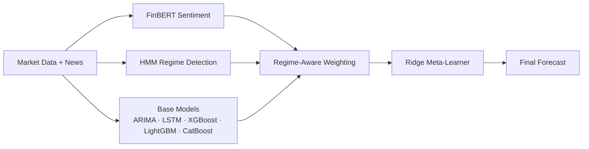

<!-- Paste into github.com/akhila2308/akhila2308 -> README.md -->
<!-- [VERIFY] = keep only if true. Replace ADD-... links after deploying. -->

# Akhila Battula

### AI/ML Engineer · LLM Agents · RAG · Applied ML

*I build LLM systems that plan, call tools, and do real work.*

 

 

---

## 👋 About

B.Tech CSE (AI/ML) graduate, 2026. **IEEE-published researcher (ICCICT 2026)** with experience from Google Cloud GenAI and Full Stack Development internships (SmartBridge / APSCHE).

I focus on three things:

| 🤖 Agents | 🔎 RAG & Data | 📈 Applied ML |
|---|---|---|
| Multi-agent LLM pipelines with tool calling and reflection loops | Natural-language interfaces over data, grounded retrieval | Regime detection, ensembles, explainability |

---

## 🚀 Featured Projects

<table>
<tr>
<td width="50%" valign="top">

### 🤖 [TZURONI](https://github.com/akhila2308/cwt-marketing-agent)
**Multi-agent marketing pipeline**

4 cooperating agents for CrowdWisdomTrading, with a reflection loop (Hermes pattern) that refines outputs before delivery.

`LangChain` `OpenRouter` `Apify` `PRAW`

[View repo →](https://github.com/akhila2308/cwt-marketing-agent)

</td>
<td width="50%" valign="top">

### 💬 [IntelliSQL](https://github.com/akhila2308/IntelliSQL)
**Natural language → SQL**

Describe the data you want in plain English. The app generates, explains, and executes the query.

`Gemini 2.5 Flash` `Streamlit` `SQL`

[View repo →](https://github.com/akhila2308/IntelliSQL) · [Live demo →](ADD-STREAMLIT-LINK) <!-- [VERIFY] -->

</td>
</tr>
<tr>
<td width="50%" valign="top">

### 📈 [Regime-Adaptive Ensemble](https://github.com/akhila2308/Regime-Adaptive-Stock-Prediction)
**Financial forecasting · IEEE ICCICT 2026**

Detects market regimes (Bull / Bear / Volatile) and weights an ensemble of models accordingly.

`HMM` `FinBERT` `LSTM` `XGBoost` `SHAP`

[View repo →](https://github.com/akhila2308/Regime-Adaptive-Stock-Prediction)

</td>
<td width="50%" valign="top">

### ✈️ [FlightFinder](https://github.com/akhila2308/FlightFinder)
**Full-stack flight booking**

Flight search, authentication, and booking management on the MERN stack.

`MongoDB` `Express` `React` `Node.js`

[View repo →](https://github.com/akhila2308/FlightFinder) · [Live demo →](ADD-VERCEL-LINK) <!-- [VERIFY] -->

</td>
</tr>
</table>

---

## 🧠 How the Regime-Adaptive Ensemble Works

---

## 🛠️ Tech Stack

| Area | Tools |
|---|---|
| **LLMs & Agents** | LangChain, OpenRouter, Gemini API, OpenAI API, prompt engineering |
| **RAG** | FAISS, embeddings, HuggingFace Transformers |
| **ML** | Scikit-learn, TensorFlow/Keras, XGBoost, LightGBM, CatBoost, FinBERT, SHAP |
| **Backend** | Python, Node.js, Express, REST APIs, SQL, MongoDB |
| **Frontend** | React, Streamlit |
| **Learning next** | LangGraph, Docker, CI/CD, RAGAS / Promptfoo, MCP |

---

## 📄 Research

**Regime-Adaptive Ensemble Learning for Financial Forecasting**
IEEE ICCICT 2026 · Extended manuscript under review at Springer Nature

---

---

## 📊 GitHub Activity

---

**Open to AI/ML Engineer, LLM/Agent Engineer, and Full Stack roles.**

